# OpenClaw 安装&配置 Linux(Ubuntu)

本文主要用于在虚拟Linux环境搭建openclaw 配置基础功能

适用于为高定制化用途(特别是多Agent)做基础准备 并非最低限安装 不适用于容器

后续配置以及Skills安装需要用户指挥Agent完成

## 1. 建立云端服务器环境or本地主机虚拟化环境
GCP CE(AWS EC2): 2 vCPU 4GB memory  20GB disk  (推荐memory >= 8GB)
开放SSH,HTTP,HTTPS访问

虚拟化工具(VMware-Workstation/VirtualBox): 2CPU核心 4GB memory 40GB disk (推荐memory >= 8GB)
设置NAT模式共享本地IP 或 设置桥接模式连接本地物理网络(推荐)

有随时ssh访问需求的话推荐使用固定IP或域名 (使用Termius等工具可以手机端进行ssh访问) 

云平台：固定IP 
家庭网络本地部署：IPv6内网穿透+域名

非固定IP可以使用Web控制台进行ssh访问 (缺点是手机访问不稳定 没有随时ssh访问需求的话可以用用)

## 2. 配置SSH连接(**强烈建议使用密钥认证**)
本地生成ssh密钥对(替换 key_name 和 user_name)
```powershell
ssh-keygen -t rsa -f key_name -C user_name
```

将**公钥(XXX.pub)**上传到虚拟机控制台
[控制台]-[虚拟机实例名(详情页)]-[修改(编辑)]
ssh密钥 添加项
将公钥输入 保存
等待虚拟机认证信息更新 或 重启虚拟机(推荐)

## 3. SSH登录
在本地打开任意一个powershell终端或ssh连接工具(Tabby/TeraTerm) **使用私钥登录虚拟机**
```powershell
ssh -i .\your_key_path\your_key_name user_name@your_server_ip
```

连接失败可以尝试清除旧密钥记录
```powershell
ssh-keygen -R your_server_ip
```

## 4. 配置环境
更新
```bash
sudo apt update && sudo apt upgrade -y
```

安装nvm
```bash
curl -o- https://raw.githubusercontent.com/nvm-sh/nvm/v0.40.1/install.sh | bash
```

设置nvm环境变量
```bash
source ~/.bashrc
```

安装node
```bash
nvm install node
```

安装相关库
```bash
sudo apt install libatomic1 -y
```

确认安装node npm
```bash
node -v
npm -v
```

## 5. 安装openclaw
安装openclaw的工具包(主程序)
```bash
npm install -g openclaw@latest
```

查看openclaw版本
```bash
openclaw --version
```

安装PM2(为了保持openclaw后台运行/手动多Agent运行)
```bash
npm install -g pm2
```

查看PM2版本
```bash
pm2 --version
```

## 6. 其他准备工作(可择情跳过)
准备下列Api key

Gemini Api Key:(推荐)
<https://aistudio.google.com/app/api-keys>

Google wprkplace Api Key:
<https://console.cloud.google.com/>

Brave Search Api Key:
<https://brave.com/search/api/>

Telegram Bot Api Key:(推荐)
<https://t.me/BotFather>

Discord Bot Api Key:
<https://discord.com/developers/applications>

## 7. 配置openclaw
```bash
openclaw onboard --install-daemon
```

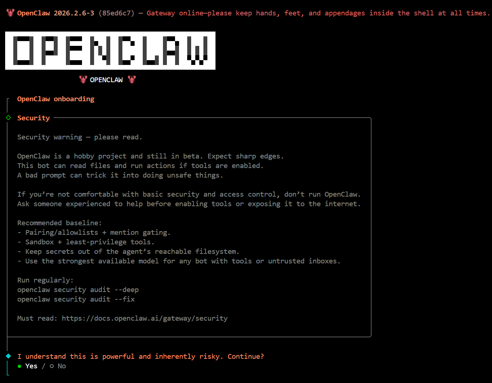

风险警告 建议不要在主力PC上配置openclaw 给它一个独立的环境

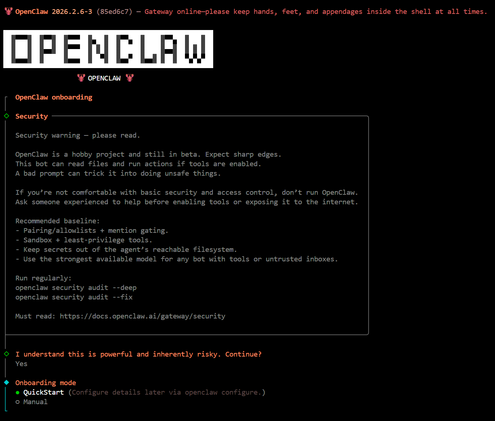

QuickStart足够了 后续可以让Agent自己配置其他功能

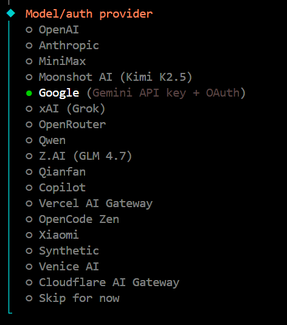

主Agent推荐：Gemini/Anthropic(Claude)

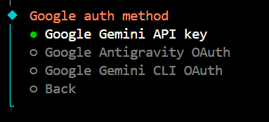

输入API-key

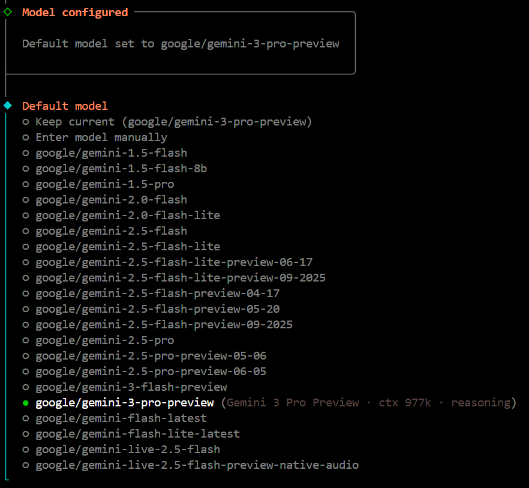

选择默认模型 注意确认你输入的API-key是否支持所选模型
完全免费选择Gemini 2.5 flash (当前2026/2/9)

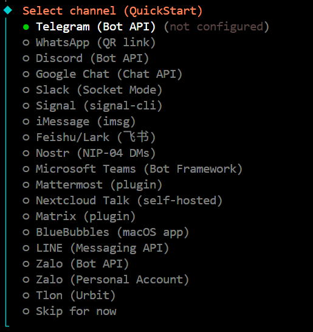

接入会话方式 推荐Telegram Discord 不推荐WhatApp
后续可以再添加其他会话方式 多频道共存

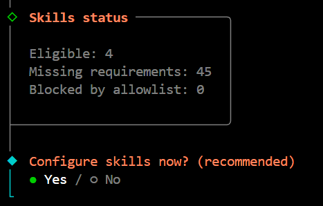

添加必要的Skills

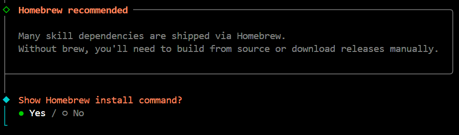
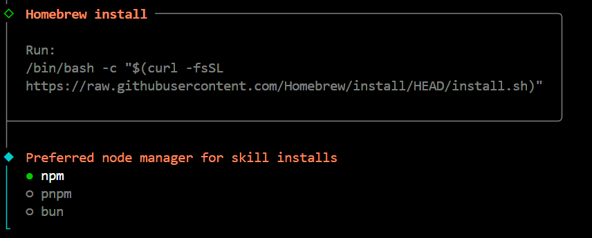

推荐选择npm方式安装 多Agent部署可以选择pnpm方式

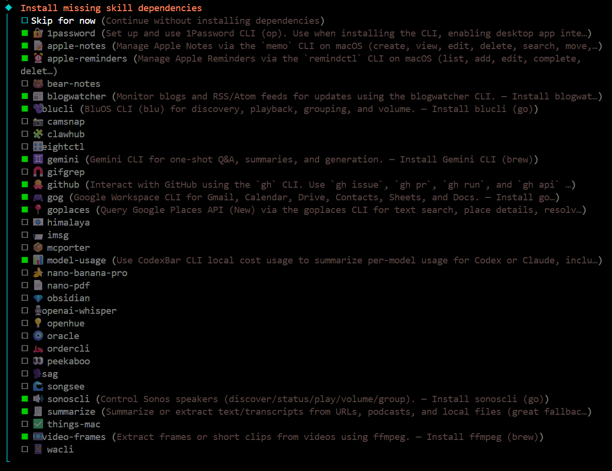

按上下方向键移动光标 按空格键选择 按回车键确认安装
初期必要skills：github summarize

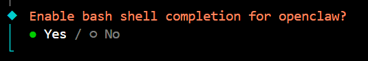

Yes！

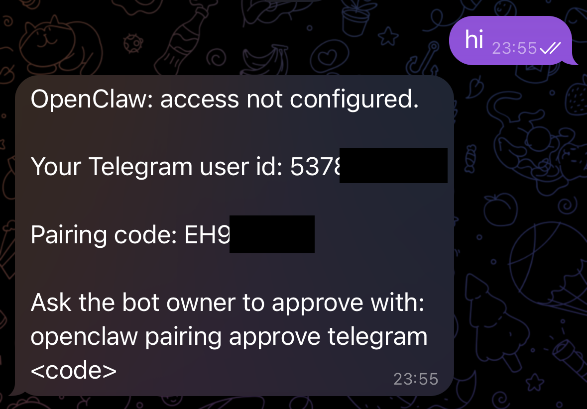

如果已经准备好Telegram(见上一章节) 此时可以向Agent发送问候 进行配对码确认

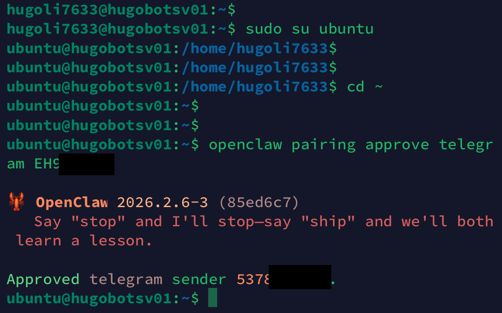

输入上述指令
```bash
openclaw pairing approve telegram XXX123XXX
```

常用gateway命令
```bash
openclaw gateway                    # 开启gateway
openclaw gateway stop               # 关闭gateway
openclaw gateway status             # 查看gateway状态
openclaw gateway uninstall          # 卸载gateway
openclaw gateway install --force    # 重新安装gateway
openclaw gateway restart            # 重启gateway
openclaw logs --follow              # 查看日志
```
TUI界面 CTRL+C退出

## 8. 使用PM2启动openclaw
```bash
pm2 start "openclaw gateway" --name openclaw00
```

也可以用systemd+cron进行管理 PM2更容易可视化控制独立的多Agent

## 9. 尾声
OpenClaw更新较为频繁(日更),相关操作不要完全参照AI工具，结合官方文档操作即可。

主力Agent不建议直接访问Moltbook/MoltX。(在未建立AI指令安全系统、API Key隐私保护系统前不要访问)

建议让Agent建立自身监视系统、健康检查系统、记忆备份系统。

Skill库ClawHub：
<https://clawhub.ai/>

OpenClaw官方文档 中文版：
<https://docs.openclaw.ai/zh-CN>


